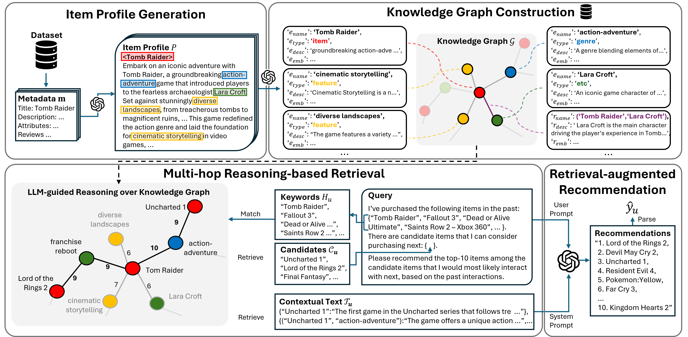

# ColdRAG

ColdRAG is the **official implementation** of our Retrieval-Augmented, Large Language Model (LLM) based cold-start recommendation system.  
This repository contains the full Qwen-based ColdRAG pipeline implemented with **vLLM** for LLM inference and **BAAI/bge-m3** for embedding-based retrieval.


# Framework


# Environment Setup

```bash
conda create -n coldrag python=3.10 -y
conda activate coldrag
pip install -r requirements.txt
```
# Starting vLLM Servers

ColdRAG requires two vLLM servers:
## Qwen LLM Server
```bash
export VLLM_QWEN_URL=http://localhost:8000/v1
export VLLM_MAX_MODEL_LEN=131072

python -m vllm.entrypoints.openai.api_server \
  --model Qwen/Qwen2.5-7B-Instruct \
  --port 8000 \
  --gpu-memory-utilization 0.8 \
  --tensor-parallel-size 1 \
  --max-model-len 131072 \
  --rope-scaling '{"type":"yarn","factor":4.0,"original_max_position_embeddings":32768}' \
  --download-dir "$CACHE_DIR"
```
## Embedding Server
```bash
export VLLM_EMBED_URL=http://localhost:8001/v1

python -m vllm.entrypoints.openai.api_server \
  --model BAAI/bge-m3 \
  --port 8001 \
  --gpu-memory-utilization 0.1 \
  --tensor-parallel-size 1 \
  --download-dir "$CACHE_DIR"
```
# Dataset & Knowledg Graph Setup
Download the processed dataset and RAG index from: https://drive.google.com/drive/folders/1QkwQugctMfLlBBhHixhjpbRf4AgsX91u?usp=sharing

Place them like this:
```bash
ColdRAG/
├── dataset/
│     └── Video_Games/...
└── rag_output_qwen/
      └── Video_Games/...
```
## Notes
- If rag_output_qwen/Video_Games/ is empty, ColdRAG will first run knowledge graph construction (indexing) and then proceed to inference.
- If the RAG index exists, ColdRAG skips indexing and runs inference directly.

# Running ColdRAG
```bash
python main.py --model ColdRAG_qwen --dataset Video_Games --core 15 --cand_size 100 --k 10 --batch_size 5
```

# Output Files
After running ColdRAG, two output files are generated:
## Prediction Log File
```bash
outputs/ColdRAG_Video_Games_core15.json
```
## Evaluation File
```bash
outputs/ColdRAG_Video_Games_core15_eval.json
```
